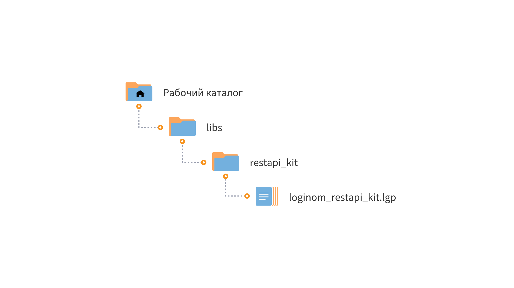

# Loginom RestApi Kit

* Версия: 1.0.0
* Проверено: Все редакции Loginom 7.2.0

Библиотека включает компоненты для работы с внешними сервисами.

## Установка

1. Определите рабочий каталог, где будут расположены ваши библиотеки:

   * Для серверных редакций — в рабочем каталоге Loginom Server (в папке пользователя или в общей папке пользователей);
   * Для настольных редакций — в любой папке на локальном диске.

2. Создайте в нем подкаталог **libs**.

3. Разместите папку **restapi_kit** в каталоге **libs**.

4. Добавьте ссылку на пакет **loginom_restapi_kit.lgp** в своем пакете и используйте компоненты библиотеки.

## Требования

Для работы библиотеки **Loginom RestApi Kit** необходимо:

* Установленное ПО Loginom. Версия не ниже 7.2.0

## Список компонентов

* [Маршутизация TomTom](./docs/tomtom-routing.md)
* [Геокодер Яндекс](./docs/yandex-geocoding.md)
* [Производственный календарь](./docs/production-calendar.md)
* [Курс валют к рублю (XML)](./docs/currency-rate-xml.md) (Только серверные редакции)
* [Курс валют к рублю (JSON)](./docs/currency-rate-json.md)
* [Уведомление в Telegram](./docs/telegram-notificaton.md)